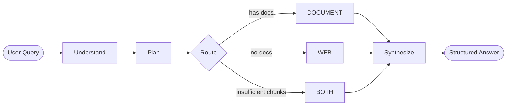
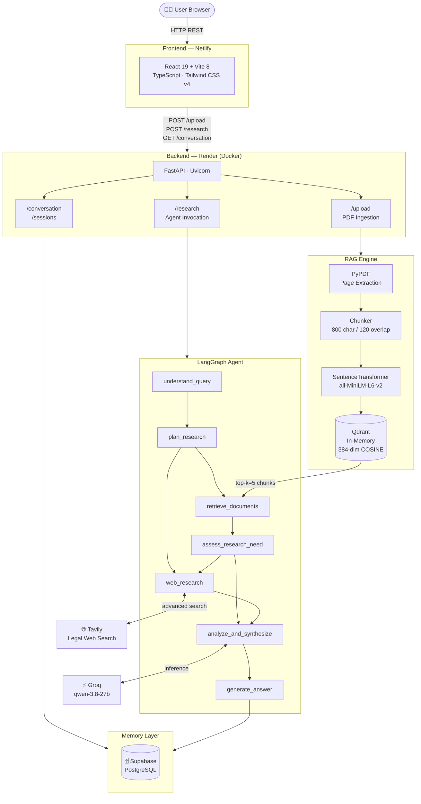
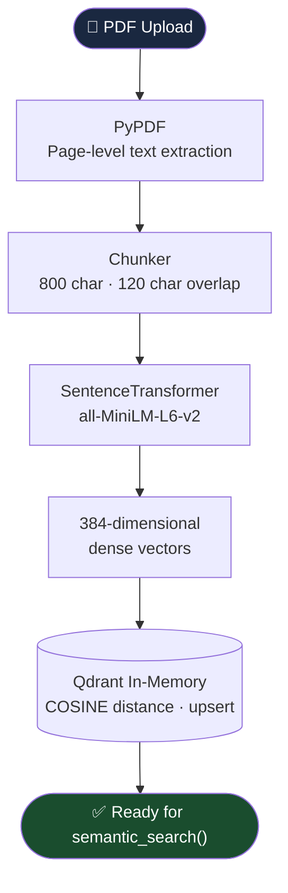
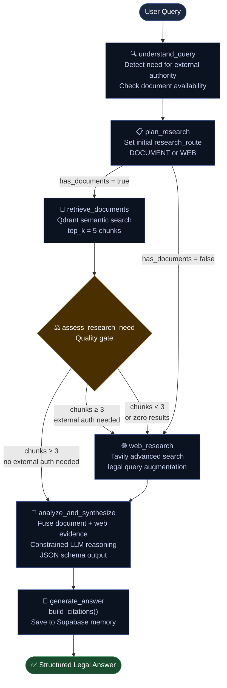
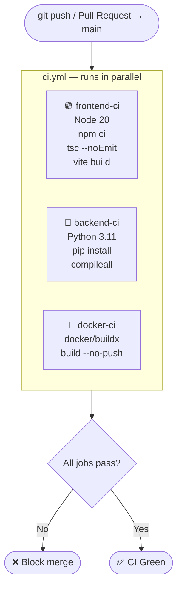
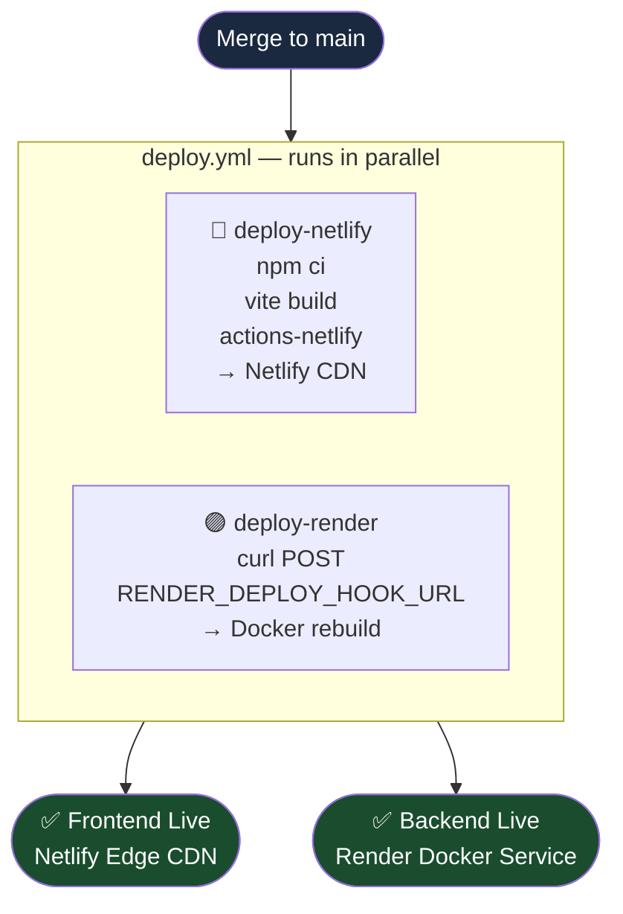

<div align="center">

# ⚖️ LexAgent — Legal Research AI

**An agentic, RAG-powered legal research system with dual-source retrieval, structured reasoning, and session memory.**

[](https://python.org)
[](https://fastapi.tiangolo.com)
[](https://react.dev)
[](https://langchain-ai.github.io/langgraph/)
[](https://groq.com)
[](https://supabase.com)
[](LICENSE)

[](https://github.com/mahek-builds/Legal-Research-AI/actions)
[](https://github.com/mahek-builds/Legal-Research-AI/actions)

</div>

---

## Table of Contents

1. [Overview](#1-overview)
2. [Key Features](#2-key-features)
3. [Technology Stack](#3-technology-stack)
4. [Core Architecture & Innovations](#4-core-architecture--innovations)
5. [System Design](#5-system-design)
6. [Agent Workflow](#6-agent-workflow)
7. [API Reference](#7-api-reference)
8. [Data Models](#8-data-models)
9. [Folder Structure](#9-folder-structure)
10. [Prerequisites](#10-prerequisites)
11. [Installation & Local Development](#11-installation--local-development)
12. [Docker & Container Deployment](#12-docker--container-deployment)
13. [Deployment](#13-deployment)
14. [Environment Variables](#14-environment-variables)
15. [GitHub Actions CI/CD](#15-github-actions-cicd)
16. [Contributing](#16-contributing)
17. [License](#17-license)

---

## 1. Overview

**LexAgent** is a production-grade, agentic legal research assistant that goes beyond a generic chatbot. Instead of routing a user query directly to a language model, LexAgent executes a structured **multi-step research pipeline**:

1. **Understands** the legal question and detects whether external authority is needed
2. **Plans** the research strategy based on available document context
3. **Retrieves** semantically relevant chunks from uploaded legal PDFs via RAG
4. **Assesses** whether additional web research is necessary
5. **Searches** authoritative legal web sources using Tavily (when required)
6. **Synthesizes** a grounded answer from all evidence sources
7. **Generates** a structured JSON response with citations and source attributions
8. **Persists** the conversation in Supabase for session continuity

The system is designed around the principle that **legal research must be grounded, traceable, and cautious** — surfacing evidence conflicts, flagging insufficient sources, and never fabricating cases, citations, or statutes.

---

## 2. Key Features

| Feature | Description |
|---|---|
| 🤖 **Agentic Routing** | Dynamically decides whether to use document RAG, web search, or both — per query |
| 📄 **PDF Document Ingestion** | Upload and process legal PDFs; text is chunked (800 char, 120 overlap) and embedded |
| 🔍 **Semantic RAG Retrieval** | In-memory Qdrant vector store with `all-MiniLM-L6-v2` embeddings (384-dim cosine similarity) |
| 🌐 **Legal Web Research** | Tavily-powered advanced web search with legal query augmentation |
| 🧠 **Dual-Source Synthesis** | Combines document evidence and web results with structured LLM reasoning |
| 📚 **Source Attribution** | Every answer includes citations — document name, page number, or URL |
| ⚠️ **Conflict Detection** | Contradictory sources are surfaced explicitly, not silently merged |
| 🗂️ **Session Memory** | Conversation history persisted in Supabase; last 3 turns fed as context |
| 🚫 **Hallucination Mitigation** | LLM constrained to use only retrieved evidence; flags insufficient data clearly |
| 🐳 **Container-Ready** | Production Dockerfile with pre-cached embeddings to eliminate Render cold-start delays |

---

## 3. Technology Stack

### Backend

| Layer | Technology | Purpose |
|---|---|---|
| API Framework | [FastAPI](https://fastapi.tiangolo.com) 0.115 | REST API with async support |
| Agent Orchestration | [LangGraph](https://langchain-ai.github.io/langgraph/) 0.2 | Stateful, conditional agent graph |
| LLM Inference | [Groq](https://groq.com) + `qwen/qwen3.8-27b` | Ultra-fast inference (temperature 0.3) |
| Vector Database | [Qdrant](https://qdrant.tech) (in-memory) | Cosine-similarity semantic search |
| Embeddings | [SentenceTransformers](https://www.sbert.net) `all-MiniLM-L6-v2` | 384-dim dense embeddings |
| Web Search | [Tavily](https://tavily.com) | Legal-focused advanced web retrieval |
| Memory / DB | [Supabase](https://supabase.com) | PostgreSQL-backed session persistence |
| PDF Parsing | [PyPDF](https://pypdf.readthedocs.io) | Page-level PDF text extraction |
| Server | [Uvicorn](https://www.uvicorn.org) | ASGI production server |

### Frontend

| Layer | Technology | Purpose |
|---|---|---|
| UI Framework | [React](https://react.dev) 19 + TypeScript | Component-based interactive UI |
| Build Toolchain | [Vite](https://vitejs.dev) 8 | Fast bundling and HMR |
| Styling | [Tailwind CSS](https://tailwindcss.com) v4 | Utility-first CSS with custom design tokens |
| Fonts | Lora, Inter, IBM Plex Mono | Professional typographic hierarchy |

### Infrastructure & DevOps

| Tool | Purpose |
|---|---|
| Docker | Containerized backend with pre-cached embedding model |
| GitHub Actions | Automated CI (lint, typecheck, build) and CD (Netlify + Render) |
| Netlify | Static frontend hosting with SPA routing and edge CDN |
| Render | Managed Docker web service hosting for backend |

---

## 4. Core Architecture & Innovations

### 4.1 Agentic Research Pipeline (Not Prompt-to-Response)

Unlike a direct RAG chatbot, LexAgent implements a stateful, conditional research graph using **LangGraph**. Each query passes through dedicated pipeline stages with conditional branching — the system can decide mid-execution to augment document retrieval with web search based on result confidence.



The agent never short-circuits: even if documents are provided, it assesses adequacy before committing to a response.

### 4.2 Dual-Source Evidence Fusion

LexAgent is one of the few open systems that **explicitly merges** internal document evidence with authoritative external web sources:

- **Document Route**: Semantic search over user-uploaded PDFs via Qdrant
- **Web Route**: Advanced legal web search via Tavily (`search_depth="advanced"`)
- **Both Route**: Document retrieval quality assessed; triggers web augmentation if `< 3` high-quality chunks are returned

### 4.3 Confidence-Gated Routing

The `assess_research_need` node evaluates retrieval quality:
- `≥ 3 chunks` AND no external authority needed → **DOCUMENT only**
- `≥ 3 chunks` AND external authority needed → **BOTH**
- `< 3 chunks` or `0 chunks` → **WEB augmentation**

This prevents low-confidence document-only answers from being presented without broader corroboration.

### 4.4 Structured Legal Reasoning Output

The LLM is constrained to respond in a strict JSON schema:

```json
{
  "summary": "Brief legal answer",
  "relevant_facts": ["..."],
  "legal_issues": ["..."],
  "applicable_law": ["statute / case law"],
  "analysis": "Detailed reasoning over evidence",
  "conclusion": "Final determination",
  "sources": [{ "type": "document|web", "page": 4, "url": "..." }],
  "warnings": ["Conflict detected between Source A and Source B"]
}
```

This structured format makes the output machine-readable, suitable for downstream processing and professional legal workflows.

### 4.5 Session-Aware Conversation Memory

Each session has a `session_id`. The last 6 messages (3 conversation turns) are injected into the reasoning prompt as `=== PREVIOUS CONVERSATION ===`. This allows the agent to resolve pronouns, build on prior legal analysis, and maintain context across multi-turn research sessions.

### 4.6 Hallucination Mitigation by Design

- LLM is explicitly instructed via system prompt to **only use facts from provided evidence**
- If `context_parts` is empty, the agent returns `"Insufficient evidence"` — it does not ask the LLM to speculate
- The structured JSON output format prevents free-form fabrication of case names or statutes

---

## 5. System Design

### High-Level Architecture



### Document Processing Pipeline



---

## 6. Agent Workflow

The LangGraph agent compiles a `StateGraph` over `ResearchState`. Below is the conditional flow:



### Agent State Schema (`ResearchState`)

| Field | Type | Description |
|---|---|---|
| `session_id` | `str` | Unique session identifier |
| `question` | `str` | User's legal research query |
| `document_ids` | `List[str]` | Uploaded document IDs to search |
| `needs_external_authority` | `bool` | Detected need for web corroboration |
| `has_documents` | `bool` | Whether document IDs are present |
| `research_route` | `str` | `DOCUMENT`, `WEB`, or `BOTH` |
| `retrieved_chunks` | `List[dict]` | Qdrant semantic search results |
| `web_results` | `List[dict]` | Tavily search results |
| `chat_history` | `List[dict]` | Last 6 Supabase messages for context |
| `reasoning` | `Optional[str]` | Raw LLM reasoning output (JSON str) |
| `answer` | `Optional[dict]` | Parsed structured answer |
| `citations` | `List[dict]` | Built citation objects |
| `status` | `str` | Pipeline status: `started → complete` |
| `warnings` | `List[str]` | Conflict or insufficiency flags |

---

## 7. API Reference

### Base URL

- **Local**: `http://localhost:8000`
- **Production**: `https://<your-render-service>.onrender.com`

### Endpoints

#### `GET /health`
> Returns service health status.

**Response:**
```json
{ "status": "ok" }
```

---

#### `POST /upload`
> Upload one or more PDF documents for RAG ingestion.

**Request:** `multipart/form-data`

| Field | Type | Required | Description |
|---|---|---|---|
| `files` | `File[]` | Yes | One or more `.pdf` files |

**Response:**
```json
{
  "status": "success",
  "documents": [
    {
      "document_id": "uuid-string",
      "filename": "contract.pdf",
      "pages": 12
    }
  ]
}
```

**Errors:**
- `400 Bad Request` — Non-PDF file submitted

---

#### `POST /research`
> Execute the full agentic research pipeline and return a structured answer.

**Request Body:**
```json
{
  "session_id": "abc-123",
  "question": "What grounds did the court cite for dismissal?",
  "document_ids": ["uuid-1", "uuid-2"]
}
```

| Field | Type | Required | Description |
|---|---|---|---|
| `session_id` | `string` | Yes | Session identifier for memory continuity |
| `question` | `string` | Yes | Legal research question |
| `document_ids` | `string[]` | No | Document UUIDs to restrict search scope |

**Response:**
```json
{
  "session_id": "abc-123",
  "status": "complete",
  "answer": {
    "summary": "The court dismissed the case on grounds of...",
    "relevant_facts": ["Fact 1", "Fact 2"],
    "legal_issues": ["Procedural fairness", "Natural justice"],
    "applicable_law": ["Section 35, Administrative Procedure Act"],
    "analysis": "Based on the retrieved evidence from Page 4...",
    "conclusion": "The appellant's argument was rejected because...",
    "sources": [
      { "type": "document", "document_name": "judgment.pdf", "page": 4, "snippet": "..." },
      { "type": "web", "title": "Supreme Court ruling", "url": "https://...", "snippet": "..." }
    ],
    "warnings": []
  }
}
```

---

#### `GET /conversation/{session_id}`
> Retrieve full message history for a session.

**Response:**
```json
{
  "session_id": "abc-123",
  "messages": [
    { "id": "uuid", "session_id": "abc-123", "role": "user", "content": "...", "created_at": "..." },
    { "id": "uuid", "session_id": "abc-123", "role": "assistant", "content": "{...json...}", "created_at": "..." }
  ]
}
```

---

#### `GET /sessions`
> List all unique research sessions ordered by most recent activity.

**Response:**
```json
{
  "sessions": [
    { "id": "abc-123", "created_at": "2026-09-23T10:00:00Z" },
    { "id": "def-456", "created_at": "2026-09-22T14:30:00Z" }
  ]
}
```

---

## 8. Data Models

### `ResearchRequest`
```python
class ResearchRequest(BaseModel):
    session_id: str
    question: str
    document_ids: Optional[List[str]] = []
```

### `ResearchAnswer`
```python
class ResearchAnswer(BaseModel):
    summary: str
    relevant_facts: Optional[List[str]] = []
    legal_issues: Optional[List[str]] = []
    applicable_law: Optional[List[str]] = []
    analysis: Optional[str] = None
    conclusion: Optional[str] = None
    sources: List[SourceReference] = []
```

### `SourceReference`
```python
class SourceReference(BaseModel):
    type: str                     # "document" | "web"
    title: Optional[str] = None   # Web source title
    url: Optional[str] = None     # Web source URL
    document_name: Optional[str] = None
    page: Optional[int] = None    # Document page number
    authority: Optional[str] = None
    date: Optional[str] = None
```

---

## 9. Folder Structure

```
Legal-Research-AI/
│
├── .github/
│   └── workflows/
│       ├── ci.yml               # CI: frontend build, backend lint, docker build
│       └── deploy.yml           # CD: Netlify frontend + Render backend
│
├── Build this feature/          # React + Vite Frontend
│   ├── src/
│   │   ├── App.tsx              # Main application component (1006 lines)
│   │   ├── main.tsx             # React DOM entry point
│   │   ├── index.css            # Tailwind v4 theme tokens + base styles
│   │   └── assets/              # Static assets
│   ├── index.html               # HTML document shell
│   ├── vite.config.ts           # Vite + React + Tailwind CSS build config
│   ├── package.json             # Frontend dependencies
│   ├── tsconfig.json            # TypeScript compiler configuration
│   └── .env.example             # Frontend environment variable template
│
├── backend/                     # FastAPI Python Backend
│   ├── app/
│   │   ├── main.py              # FastAPI app, CORS, router registration
│   │   ├── config.py            # Settings via environment variables
│   │   │
│   │   ├── agent/               # LangGraph agentic pipeline
│   │   │   ├── graph.py         # StateGraph definition & run_research()
│   │   │   ├── nodes.py         # Pipeline node implementations
│   │   │   ├── router.py        # Conditional edge routing functions
│   │   │   └── state.py         # ResearchState TypedDict schema
│   │   │
│   │   ├── api/                 # REST API route handlers
│   │   │   ├── upload.py        # POST /upload — PDF ingestion
│   │   │   ├── research.py      # POST /research — agent invocation
│   │   │   └── conversation.py  # GET /conversation, GET /sessions
│   │   │
│   │   ├── rag/                 # Retrieval-Augmented Generation
│   │   │   ├── loader.py        # PyPDF page-level text extraction
│   │   │   ├── chunker.py       # Text chunking (800 char, 120 overlap)
│   │   │   ├── embeddings.py    # SentenceTransformer embedding model
│   │   │   └── retriever.py     # Qdrant in-memory vector store + search
│   │   │
│   │   ├── llm/
│   │   │   └── model.py         # Groq client, generate() wrapper
│   │   │
│   │   ├── search/
│   │   │   └── legal_search.py  # Tavily legal web search (advanced depth)
│   │   │
│   │   ├── memory/
│   │   │   └── conversation.py  # Supabase message persistence
│   │   │
│   │   ├── citations/
│   │   │   └── builder.py       # Citation object construction
│   │   │
│   │   └── schemas/
│   │       ├── research.py      # ResearchRequest, ResearchAnswer Pydantic models
│   │       ├── conversation.py  # Conversation response schemas
│   │       └── upload.py        # Upload response schemas
│   │
│   ├── Dockerfile               # Production container (python:3.11-slim)
│   ├── .dockerignore            # Docker build context exclusions
│   ├── requirements.txt         # Python dependencies (pinned versions)
│   └── .env.example             # Backend environment variable template
│
├── Dockerfile                   # Root-context Dockerfile (builds from /backend)
├── .dockerignore                # Root-level Docker build exclusions
├── docker-compose.yml           # Local container orchestration
├── netlify.toml                 # Netlify build configuration
├── render.yaml                  # Render Blueprint (Infrastructure-as-Code)
├── .gitignore                   # Git ignore rules
├── LICENSE                      # MIT License
└── README.md                    # This document
```

---

## 10. Prerequisites

| Requirement | Version | Notes |
|---|---|---|
| Python | 3.11+ | Required for backend |
| Node.js | 20+ | Required for frontend |
| npm | 10+ | Frontend package manager |
| Docker | 24+ | Optional, for containerized local testing |
| Groq Account | — | Free tier available at [console.groq.com](https://console.groq.com) |
| Tavily Account | — | Free tier at [app.tavily.com](https://app.tavily.com) |
| Supabase Project | — | Free tier at [supabase.com](https://supabase.com) |

### Supabase Table Setup

Execute the following SQL in your Supabase SQL Editor before running the application:

```sql
CREATE TABLE messages (
    id          UUID PRIMARY KEY DEFAULT gen_random_uuid(),
    session_id  TEXT NOT NULL,
    role        TEXT NOT NULL CHECK (role IN ('user', 'assistant')),
    content     TEXT NOT NULL,
    created_at  TIMESTAMPTZ NOT NULL DEFAULT NOW()
);

CREATE INDEX idx_messages_session_id ON messages (session_id);
CREATE INDEX idx_messages_created_at ON messages (created_at DESC);
```

---

## 11. Installation & Local Development

### Backend Setup

```bash
# 1. Clone the repository
git clone https://github.com/mahek-builds/Legal-Research-AI.git
cd Legal-Research-AI

# 2. Create and activate a virtual environment
python -m venv .venv

# Windows
.venv\Scripts\activate

# Linux / macOS
source .venv/bin/activate

# 3. Install Python dependencies
pip install -r backend/requirements.txt

# 4. Configure environment variables
cp backend/.env.example backend/.env
# Edit backend/.env with your actual API keys

# 5. Start the FastAPI server
cd backend
uvicorn app.main:app --reload --host 0.0.0.0 --port 8000
```

The backend API will be available at `http://localhost:8000`.
Interactive API documentation (Swagger UI) is at `http://localhost:8000/docs`.

---

### Frontend Setup

```bash
# 1. Navigate to the frontend directory
cd "Build this feature"

# 2. Install dependencies
npm install

# 3. Configure the backend API URL
cp .env.example .env
# Edit .env:
# VITE_API_BASE_URL=http://localhost:8000

# 4. Start the development server
npm run dev
```

The frontend will be available at `http://localhost:5173`.

---

### Available Scripts (Frontend)

| Command | Description |
|---|---|
| `npm run dev` | Start Vite development server with HMR |
| `npm run build` | Compile TypeScript and bundle for production |
| `npm run typecheck` | Run TypeScript type checking (`tsc --noEmit`) |
| `npm run preview` | Preview production build locally |

---

## 12. Docker & Container Deployment

### Local Docker Testing

```bash
# Build and start the backend container
docker compose up --build

# The API will be available at http://localhost:8000
```

The [docker-compose.yml](docker-compose.yml) mounts `./backend/.env` and `./backend/uploads/` as volumes.

### Manual Docker Build

```bash
# Build using the backend Dockerfile
docker build -f backend/Dockerfile -t lexagent-backend:latest ./backend

# Run the container
docker run -p 8000:8000 \
  --env-file ./backend/.env \
  lexagent-backend:latest
```

### Key Dockerfile Design Decisions

- **Base Image**: `python:3.11-slim` — minimal footprint with full build toolchain support
- **Pre-cached Embeddings**: The `all-MiniLM-L6-v2` model (≈90MB) is downloaded during `docker build`, not at container startup — this eliminates Render health check timeouts caused by first-request model downloads
- **Dynamic PORT**: Binds to `${PORT:-8000}`, which Render overrides at runtime
- **HEALTHCHECK**: Built-in Docker health probe at `/health` with 40s start period

---

## 13. Deployment

### Backend → Render

**Option A: Render Blueprint (Recommended)**

1. Push this repository to GitHub.
2. Go to [dashboard.render.com](https://dashboard.render.com) → **New + → Blueprint**.
3. Select your repository. Render automatically detects [`render.yaml`](render.yaml).
4. Fill in the secret environment variables when prompted:
   - `GROQ_API_KEY`
   - `TAVILY_API_KEY`
   - `SUPABASE_URL`
   - `SUPABASE_KEY`
5. Click **Apply**. Render builds the Docker image and starts the service.
6. Copy the generated service URL (e.g., `https://lexagent-backend.onrender.com`).

**Option B: Manual Web Service**

| Setting | Value |
|---|---|
| Runtime | Docker |
| Dockerfile Path | `backend/Dockerfile` |
| Docker Context | `backend` |
| Health Check Path | `/health` |
| Environment | See [§14 Environment Variables](#14-environment-variables) |

---

### Frontend → Netlify

1. Go to [app.netlify.com](https://app.netlify.com) → **Add new site → Import an existing project**.
2. Connect GitHub and select this repository.
3. Netlify auto-detects settings from [`netlify.toml`](netlify.toml):
   - **Base directory**: `Build this feature`
   - **Build command**: `npm run build`
   - **Publish directory**: `Build this feature/dist`
4. Under **Site configuration → Environment variables**, add:
   - `VITE_API_BASE_URL` = `https://your-render-backend.onrender.com`
5. Click **Deploy Site**.

> The included `netlify.toml` configures SPA fallback routing (`/* → /index.html 200`) and `Cache-Control: immutable` for hashed assets.

---

## 14. Environment Variables

### Backend

| Variable | Required | Default | Description |
|---|---|---|---|
| `GROQ_API_KEY` | ✅ Yes | — | Groq API key for LLM inference |
| `TAVILY_API_KEY` | ✅ Yes | — | Tavily API key for legal web search |
| `SUPABASE_URL` | ✅ Yes | — | Supabase project URL |
| `SUPABASE_KEY` | ✅ Yes | — | Supabase service role or anon key |
| `QDRANT_MODE` | No | `memory` | Vector DB mode (`memory` = in-process) |
| `UPLOAD_DIR` | No | `uploads` | Directory path for uploaded PDF files |
| `MAX_FILE_SIZE_MB` | No | `20` | Maximum upload size in megabytes |
| `ALLOWED_ORIGINS` | No | `*` | CORS origins (comma-separated or `*`) |
| `LLM_MODEL` | No | `qwen/qwen3.8-27b` | Groq model identifier |
| `EMBEDDING_MODEL` | No | `all-MiniLM-L6-v2` | SentenceTransformer model name |
| `PORT` | Auto on Render | `8000` | Uvicorn bind port |

### Frontend

| Variable | Required | Description |
|---|---|---|
| `VITE_API_BASE_URL` | ✅ Yes (prod) | Backend service URL — defaults to `http://127.0.0.1:8000` in development |

> **Security Note:** Never commit `.env` files. Only `.env.example` templates are tracked in git. Add production secrets directly in Render and Netlify dashboards.

---

## 15. GitHub Actions CI/CD

### CI Pipeline (`.github/workflows/ci.yml`)

Triggered on every `push` and `pull_request` to `main`.



### CD Pipeline (`.github/workflows/deploy.yml`)

Triggered on every push to `main`.



### Required GitHub Secrets

Add these in your repository at **Settings → Secrets and variables → Actions**:

| Secret | Where to Get It |
|---|---|
| `NETLIFY_AUTH_TOKEN` | Netlify → User Settings → Personal Access Tokens |
| `NETLIFY_SITE_ID` | Netlify → Site configuration → General → Site ID |
| `RENDER_DEPLOY_HOOK_URL` | Render → Web Service → Settings → Deploy Hooks |
| `VITE_API_BASE_URL` | Your Render backend URL |

---

## 16. Contributing

We welcome contributions. Please follow the standard GitHub workflow:

```bash
# 1. Fork the repository and clone your fork
git clone https://github.com/your-username/Legal-Research-AI.git

# 2. Create a feature branch
git checkout -b feature/your-feature-name

# 3. Make your changes, then verify
# Frontend: npm run typecheck && npm run build
# Backend: python -m compileall backend/app

# 4. Commit with a descriptive message
git commit -m "feat: add support for ..."

# 5. Push and open a Pull Request
git push origin feature/your-feature-name
```

**Commit Convention:** Use [Conventional Commits](https://www.conventionalcommits.org/):
- `feat:` New features
- `fix:` Bug fixes
- `refactor:` Code restructuring
- `docs:` Documentation updates
- `chore:` Build system or tooling changes

---

## 17. License

This project is licensed under the **MIT License**. See [LICENSE](LICENSE) for full terms.

---

<div align="center">

**Built with ⚖️ for legal research accuracy, traceability, and responsible AI.**

</div>
