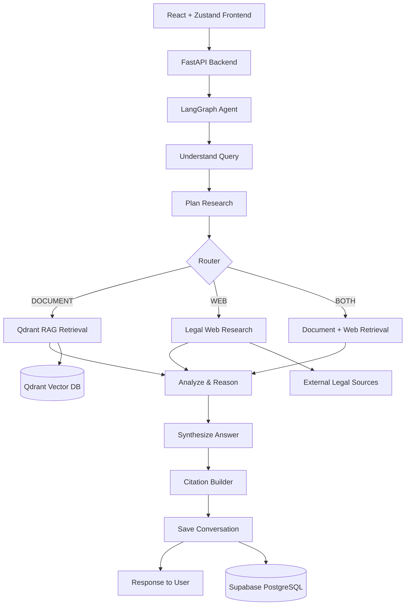

# Legal Research AI 

## 1. Executive Summary

The Legal Research AI Agent is an agentic legal research system designed to support legal analysis through a structured workflow that goes beyond simple Q&A. Instead of sending a user query directly to a language model, the system follows a research-oriented pipeline: it understands the legal question, plans the investigation, retrieves authority from relevant documents and external sources, reasons over the evidence, synthesizes a grounded answer, attributes sources, and maintains conversational continuity.

This project is intended to demonstrate a real research workflow suitable for legal use cases, particularly for internship evaluation and applied AI system design. It is built around the principle that legal research must be grounded, traceable, and cautious. The system is designed to:

- ingest legal documents, especially PDFs
- search within uploaded materials using Retrieval-Augmented Generation (RAG)
- decide whether a question requires document-only research, external legal web research, or both
- reason across multiple sources before answering
- cite supporting sources and document limitations
- preserve session memory for follow-up legal questions
- flag conflicts or insufficient evidence rather than silently merging contradictory authorities

> This repository currently contains the project structure and foundational modules for the architecture. Some implementation details are scaffolded and should be validated directly in the code before being treated as production-ready.

---

## 2. Problem Statement

Legal research is a high-risk, evidence-dependent activity. A generic chatbot can produce persuasive but unsupported language, which is especially problematic in legal settings. In the absence of source grounding, legal answers may include made-up cases, non-existent citations, inaccurate propositions, or incorrect legal reasoning.

This project addresses that gap by building a system that:

- understands legal questions in context
- decides research strategy based on evidence availability
- retrieves material from user-uploaded documents and authoritative external legal sources
- reasons over the retrieved evidence
- produces answer structures suitable for legal analysis
- preserves citations and historical context across a conversation

The objective is not to replace a lawyer, but to create a reliable research assistant that helps narrow the issue, surface authorities, identify gaps, and ground conclusions in retrieved evidence.

---

## 3. Core Architecture & Innovations

### 3.1 Core Design Principles

This project is designed as an agentic workflow rather than as a simple prompt-to-response chatbot. The system is organized around a sequence of specialized steps:

- Understand the legal issue
- Plan the research strategy
- Retrieve relevant evidence
- Research externally when needed
- Reason over retrieved information
- Synthesize the final answer
- Cite the evidence
- Remember the conversation context

### 3.2 Key Architectural Innovations

1. Agentic routing logic
   - The system determines whether the query should use document research, web research, or both.
   - This is a key distinction from a basic RAG chatbot, which typically performs a single retrieval step and answers immediately.

2. Grounded legal retrieval
   - Uploaded legal documents are processed into chunks, embedded, and stored for semantic retrieval.
   - Retrieval is based on relevance to the user's legal question, not blind context stuffing.

3. Dual-source legal analysis
   - The system can combine internal document evidence with external legal authorities when required.
   - This is important for cases involving recent developments, new precedent, or comparison with external law.

4. Source attribution and traceability
   - Research output is expected to retain document metadata such as title, page number, and chunk-level provenance.
   - Web sources are expected to retain title, authority, date, and URL when available.

5. Conflict-aware reasoning
   - Contradictory or conflicting authorities should be surfaced rather than silently merged.
   - This is important in legal research because conflicting precedent or inconsistent interpretations must be explicitly called out.

6. Memory-aware conversation flow
   - Conversation history is preserved through session IDs so the system can resolve follow-up questions using earlier context.
   - This allows the assistant to maintain legal continuity across questions.

7. Hallucination mitigation
   - The system is designed to avoid inventing cases, statutes, citations, decisions, or URLs.
   - When evidence is insufficient, it should say so explicitly.

---

## 4. System Design

### High-Level Architecture

The architecture is organized as a modular application with a clear separation between frontend interaction, API surface, agent workflow, retrieval services, and persistence.



### Design Overview

- Frontend: user interface for uploading legal documents, tracking research state, and viewing answers
- Backend API: request handling, orchestration, and workflow control
- Agent layer: route planning and stateful reasoning using LangGraph
- Retrieval layer: document search and external legal search
- Storage layer: vector database for embeddings, relational database for session memory
- Citation layer: support for grounded answer generation and source traceability

---

## 5. Agent Workflow

The core intelligence sits in the LangGraph-based agent workflow. The system is expected to execute a sequential process where the agent moves from understanding to action to synthesis.

### 5.1 `understand_query`
Purpose:
- interpret the legal question
- identify document dependency
- determine issue type, jurisdictional scope, and whether external legal authority is required

### 5.2 `plan_research`
Purpose:
- select research approach
- choose among document-only, web search, or combined strategy
- decide which authorities or documents are likely relevant

### 5.3 `retrieve_documents`
Purpose:
- use the document corpus to search for relevant legal content
- rank chunks using semantic similarity and metadata
- pass the most relevant context into the reasoning layer

### 5.4 `web_research`
Purpose:
- perform legal-focused external research when the uploaded documents are insufficient
- gather supporting authorities or recent context
- prioritize authoritative legal sources and acceptable legal institutions

### 5.5 `analyze_and_synthesize`
Purpose:
- compare retrieved facts and legal authorities
- resolve contradictions or conflicts
- structure the answer into legal analysis sections
- decide whether the evidence is sufficient

### 5.6 Citation generation
Purpose:
- attach source references to the final answer
- include citations for documents and web references where available
- ensure unsupported statements are separated from evidentiary findings

### Conditional Routing

The router decides the path depending on the legal question and evidence availability:

- DOCUMENT: when the uploaded documents contain sufficient relevant legal material
- WEB: when external legal information, new authority, or current developments are needed
- BOTH: when uploaded materials must be compared with external precedent or ongoing legal developments

The system is expected to avoid unnecessary web searches when the uploaded documents are already sufficient.

---

## 6. Research Routing Strategy

The routing layer is one of the most important parts of this project because it governs whether the system behaves like a document-only legal assistant or a broader legal research engine.

### DOCUMENT
Use this route when:
- the uploaded documents already cover the issue
- the legal question is answered by the available corpus
- no newer or external authority is required

### WEB
Use this route when:
- current legal developments are relevant
- external authorities are required for validation
- a recent decision or statutory update may affect the answer

### BOTH
Use this route when:
- the uploaded document needs comparison with external precedent
- the legal issue involves a recent legal change or evolving law
- the uploaded record should be tested against external authority and legal analysis

### Routing Principle
The system should prefer the minimum required research path. In other words, it should avoid performing external web search when internal document retrieval already yields a sufficient answer.

---

## 7. RAG Pipeline

The retrieval architecture is built around Retrieval-Augmented Generation to keep answers grounded in provided legal materials.

```text
PDF
  → Text Extraction
  → Chunking
  → Embeddings
  → Qdrant Vector Store
  → Semantic Search
  → Relevant Chunks
  → LLM Context
  → Answer Generation
```

### Pipeline Details

1. PDF upload
   - legal documents are uploaded to the system
2. Text extraction
   - raw PDF content is converted into text
3. Chunking
   - documents are divided into smaller, relevant chunks for retrieval
4. Embeddings
   - chunk content is transformed into vector representations
5. Qdrant storage
   - embeddings and metadata are stored for efficient similarity search
6. Retrieval
   - the user question is embedded and compared against stored legal chunks
7. Relevant context injection
   - only relevant chunks are passed to the reasoning layer

### Important Design Principle
The system is not expected to send entire legal documents to the model for every question. Instead, it retrieves targeted chunks and injects the minimal relevant context needed for analysis. This reduces context overload and improves traceability.

### Metadata Expectations
Metadata should include identifiers that help anchor each retrieved chunk to its source, such as:

- document name
- page number
- chunk ID
- document ID
- optional section identifiers if available

---

## 8. Legal Web Research

When document evidence is insufficient or external legal authority is required, the system performs legal-focused web research.

### Intended Workflow

1. Query generation
   - convert the user’s issue into a research query designed for legal search
2. Legal-focused search
   - search for precedent, statutes, regulations, court decisions, or authoritative legal commentary
3. Source evaluation
   - prioritize authoritative sources such as:
     - Supreme Court and High Courts
     - government and legislative bodies
     - regulators and official gazettes
     - established legal publication sources
4. Context injection
   - selected web results are passed into the reasoning context alongside document evidence
5. Citation generation
   - cited external sources are attached to the final answer with title, authority, date, and link when available

> The project is intentionally designed to prefer credible legal sources. The actual web-search provider or implementation must be verified in the code before being described as a deployed dependency.

---

## 9. Conversation Memory

Legal research is rarely single-turn. Follow-up questions often depend on earlier discussion, prior facts, or previous holdings. The system therefore includes conversation memory.

### Memory Model

- a `session_id` identifies a single conversation
- previous user/system messages are stored in persistence
- follow-up legal questions are interpreted in the context of prior turns
- previous research may influence later retrieval and synthesis

### Persistence Source
The system is designed to use Supabase PostgreSQL as the persistent source of truth for conversation state, rather than relying on process-local memory. This ensures continuity across sessions and server restarts.

---

## 10. Database Design

### Core Relational Tables

#### `sessions`
| Field | Description |
| --- | --- |
| `id` | unique session identifier |
| `created_at` | session creation time |
| `updated_at` | last update time |

#### `messages`
| Field | Description |
| --- | --- |
| `id` | unique message identifier |
| `session_id` | foreign key linking to the session |
| `role` | sender type such as user or assistant |
| `content` | message content |
| `created_at` | message timestamp |

### Vector Retrieval Store
The project uses Qdrant as the vector database for storing and searching embeddings generated from legal document chunks. This enables semantic retrieval across uploaded legal texts.

---

## 11. API Endpoints

The repository contains API modules under `backend/app/api`, but the implementation details must be verified in code before being treated as a production API contract. The following endpoints reflect the intended project design and should be treated as expected functionality unless implemented and validated.

### Planned / Expected Endpoints

- `POST /upload`
  - upload and process legal documents
  - expected to validate file type and trigger document ingestion

- `POST /research`
  - start a research workflow using the LangGraph agent
  - expected to accept a legal question and a session context

- `GET /conversation/{session_id}`
  - retrieve prior conversation messages for a session

> Any endpoint not present in the actual code should be considered a design requirement rather than an implemented API contract.

---

## 12. Legal Answer Structure

The system is expected to generate legal answers in a structured, readable format rather than a flat yes/no response. Typical answer sections may include:

- Summary
- Relevant Facts
- Legal Issues
- Applicable Law
- Court Reasoning / Analysis
- Relevant Precedents
- Conclusion
- Sources

Not every research answer will require all sections. The structure should adapt to the legal issue and available evidence.

---

## 13. Source Attribution

The answer quality depends heavily on proper attribution. The system should keep track of the origin of each claim.

### Document Citations
For content drawn from uploaded material, source attribution may include:

- document name
- page number
- section or paragraph if available
- chunk ID or provenance metadata

Example:

- Document: judgment.pdf
- Page: 12
- Section: paragraph 4

### Web Source Citations
For external legal sources, the final answer may include:

- title
- court or authority
- date
- URL

### Hallucination Guardrail
The system is designed to avoid fabricating legal authorities or citations. When supporting evidence is unavailable or insufficient, the system should communicate the limitation rather than inventing a source.

---

## 14. Handling Conflicting Authorities

Legal research often involves conflicting or competing authorities. The system is expected to identify and surface such conflicts instead of silently blending contradictory conclusions.

### Conflict Handling Principle
- identify contradictory propositions
- distinguish between primary and secondary authority
- explain the tension in the analysis
- state whether the conflict affects the conclusion
- avoid presenting contradictory authorities as if they were the same authority

This behavior is essential in legal research because a conflict may materially affect the conclusion.

---

## 15. Frontend Overview

The frontend is intended to provide a practical research workflow for legal users.

### Planned Components

- `FileUpload` — document upload interface
- `FileList` — displays uploaded documents and metadata
- `ResearchInput` — query input and session actions
- `ResearchProgress` — progress and workflow status screen
- `Answer` — final research output
- `Sources` — evidence and citation display
- `ChatHistory` — prior conversation and follow-up context

### State Management
Zustand is intended to manage the UI state for:

- uploaded files
- current research session
- question input
- loading status
- answer content
- citation results
- chat history

---

## 16. Backend Structure

The backend is organized to keep the system modular and extensible.

### Module Responsibilities

- `api/` — request handlers and routing logic
- `schemas/` — request/response models and validation schemas
- `agent/` — LangGraph orchestration, states, and routes
- `rag/` — PDF processing, chunking, embedding, and retrieval logic
- `search/` — legal web search integration
- `memory/` — session and conversation persistence logic
- `llm/` — language model configuration and integration
- `citations/` — citation creation and evidence formatting

This structure is suitable for a modular monolith and supports future scaling into separate services if required.

---

## 17. Setup & Installation

### 17.1 Backend Setup

1. Create a Python virtual environment:

```bash
cd backend
python -m venv .venv
source .venv/bin/activate   # Linux/macOS
.venv\Scripts\activate      # Windows
```

2. Install dependencies:

```bash
pip install -r requirements.txt
```

3. Configure environment variables in `.env`:

```bash
# Example placeholders only
LLM_API_KEY=<your_llm_api_key>
QDRANT_URL=<qdrant_url>
QDRANT_API_KEY=<qdrant_api_key>
SUPABASE_URL=<supabase_url>
SUPABASE_KEY=<supabase_key>
WEB_SEARCH_API_KEY=<optional_web_search_key>
```

4. Run the FastAPI application:

```bash
uvicorn app.main:app --reload --host 0.0.0.0 --port 8000
```

> The repository currently contains the project skeleton; the exact runtime startup path should be verified in the code before deployment.

### 17.2 Frontend Setup

1. Change into the frontend workspace:

```bash
cd workspace
npm install
```

2. Create a `.env` file if needed and configure frontend variables:

```bash
VITE_API_BASE_URL=<backend_api_url>
```

3. Start the React app:

```bash
npm run dev
```

---

## 18. Environment Variables

The environment variables below are representative placeholders and must be validated against the implementation. Some are required only when the corresponding feature is enabled.

| Variable | Required | Description |
| --- | --- | --- |
| `LLM_API_KEY` | Yes, when using an LLM | API key for the deployed model provider |
| `QDRANT_URL` | Yes, for RAG and vector storage | Qdrant endpoint |
| `QDRANT_API_KEY` | Optional | API key for secured Qdrant deployments |
| `SUPABASE_URL` | Yes, for conversation persistence | Supabase project URL |
| `SUPABASE_KEY` | Yes, for database access | Supabase service or anon key depending on implementation |
| `WEB_SEARCH_API_KEY` | Optional | API key for legal web search integration |
| `JWT_SECRET` | Optional | if auth is added later |
| `APP_ENV` | Optional | environment mode, such as dev or prod |

> Do not add undocumented variables to production configuration unless validated in the code.

---

## 19. Example Research Flows

### Example 1: Document-based legal research
User uploads a judgment and asks: "What reasoning did the court give for rejecting the appellant's argument regarding procedural fairness?"

Expected flow:
- document retrieval query on uploaded material
- semantic search across PDF chunks
- answer grounded in uploaded judgment
- citation to judgement document and page/section

Result: `DOCUMENT`

### Example 2: External legal research
User asks: "What are the recent Supreme Court developments on this issue?"

Expected flow:
- router identifies a need for current external authority
- legal web search is triggered
- sources are evaluated for authority and recency
- answer is synthesized with external support

Result: `WEB`

### Example 3: Combined document + external comparison
User asks: "Compare the uploaded judgment with the latest precedent on similar legal principles."

Expected flow:
- retrieve internal case content
- conduct legal web search for recent precedents
- compare internal reasoning and external authority
- flag differences or inconsistencies

Result: `BOTH`

### Follow-up Example
User: "What did the court say about the same issue in the earlier part of the judgment?"

Expected behavior:
- use the same `session_id`
- recover earlier messages and document context
- answer without losing continuity

---

## 20. Reliability & Edge Cases

The system should be designed to handle the following circumstances explicitly. Some are planned behaviors and should be implemented and validated in code before being treated as guaranteed.

- No documents uploaded
  - the system should request a document or explain that document research is unavailable
- Irrelevant documents
  - retrieval should return low relevance and the system should say the uploaded material is not directly relevant
- Empty or invalid PDFs
  - file validation should reject or flag unreadable files
- No relevant chunks
  - the system should explain that the evidence base is insufficient
- Web search failure
  - the system should fall back gracefully and avoid fabricating findings
- LLM failure
  - the workflow should handle model access issues and return a clear error status
- Conflicting sources
  - the system should surface the discrepancy instead of merging contradictory holdings
- Insufficient evidence
  - the system should communicate uncertainty and avoid unsupported conclusions
- Follow-up questions
  - memory and context continuity should be preserved using session state
- Duplicate uploads
  - duplicates should be prevented or de-duplicated
- Long documents
  - chunking and retrieval should manage large inputs efficiently
- Token/context limits
  - the system should limit retrieved context to relevant chunks and avoid overload

> Planned limitation: not every edge case may be fully implemented in the current scaffolded repo. This should be verified in code before release.

---

## 21. Security Considerations

The project must be handled as a security-conscious application, especially because legal research may involve sensitive documents and confidential information.

- API keys and secrets should be stored in `.env` and never committed to Git
- `.env` files should be excluded from version control
- uploaded documents should be validated for file type, size, and content quality
- internal secrets should never be exposed in logs or responses
- legal research outputs are informational and should not be treated as professional legal advice
- user-uploaded documents should be handled according to access and storage policies

---

## 22. Scalability

This project is structured as a modular monolith suitable for an internship or early-stage production prototype. It separates responsibilities cleanly enough to evolve into a distributed architecture over time.

### Path to Scale

```text
React Frontend
  → Load Balancer
  → Multiple FastAPI Instances
  → Qdrant / Supabase
  → External Web Search
  → LLM Services
```

### Scalability Characteristics

- frontend can scale independently from backend
- document ingestion can be processed asynchronously in future iterations
- retrieval and vector search can move to dedicated infrastructure if document volume grows
- conversation state is persisted in PostgreSQL rather than relying on in-memory process state

---

## 23. Limitations

This project is valuable as a research assistant, but it has real limitations:

- LLM output may contain errors or unsupported assertions
- web coverage depends on the availability and quality of legal sources
- legal interpretation requires human review and professional legal verification
- source availability may change over time
- the system may not perfectly resolve jurisdictional or factual nuance without expert review
- the system is a research assistant, not a lawyer

---

## 24. Future Improvements

The following improvements are appropriate next steps beyond the current scaffolded implementation:

### Implemented / Partially Planned
- document upload and ingestion workflow
- retrieval-augmented legal search
- legal research routing
- session-based conversation memory
- structured answer generation

### Future Enhancements
- better legal source ranking and authority scoring
- hybrid retrieval with sparse + dense methods
- reranking for legal relevance
- stronger citation verification
- OCR for scanned PDFs and image-based legal documents
- asynchronous document processing
- streaming research progress updates
- richer legal knowledge graph
- automated conflict detection and authority mapping
- benchmark-driven evaluation against legal QA tasks

---

## 25. Why This Is an Agentic Legal Research System

This system is more than a basic RAG chatbot because it explicitly performs a legal research workflow rather than a one-shot answer generation step.

It is designed to follow the sequence:

Understand → Plan → Retrieve → Research → Reason → Synthesize → Cite → Remember

### Why this matters

- Understand: interpret the legal issue and detect intent
- Plan: decide whether the research should be document-only, web-based, or combined
- Retrieve: fetch the most relevant internal and external legal evidence
- Research: collect supporting legal authority beyond the uploaded documents when required
- Reason: analyze evidence and identify contradictions or gaps
- Synthesize: construct an answer based on evidence and legal logic
- Cite: attach grounded source references
- Remember: maintain session continuity for follow-up legal questions

This is the core reason the project is best described as an agentic legal research system rather than a simple chatbot.

---

## 26. Project Structure

The project follows the repository structure below. Some directories are currently scaffolding placeholders and should be validated in code before assuming full implementation details.

```text
legal-research-ai/
│
├── backend/
│   ├── app/
│   │   ├── main.py
│   │
│   │   ├── api/
│   │   │   ├── upload.py
│   │   │   ├── research.py
│   │   │   └── conversation.py
│   │
│   │   ├── schemas/
│   │   │   ├── upload.py
│   │   │   ├── research.py
│   │   │   └── conversation.py
│   │
│   │   ├── agent/
│   │   │   ├── graph.py
│   │   │   ├── state.py
│   │   │   ├── nodes.py
│   │   │   └── router.py
│   │
│   │   ├── rag/
│   │   │   ├── loader.py
│   │   │   ├── chunker.py
│   │   │   ├── embeddings.py
│   │   │   └── retriever.py
│   │
│   │   ├── search/
│   │   │   └── legal_search.py
│   │
│   │   ├── memory/
│   │   │   └── conversation.py
│   │
│   │   ├── llm/
│   │   │   └── model.py
│   │
│   │   └── citations/
│   │       └── builder.py
│   │
│   ├── requirements.txt
│   └── .env
│
├── workspace/
│   ├── src/
│   │   ├── components/
│   │   │   ├── FileUpload.jsx
│   │   │   ├── FileList.jsx
│   │   │   ├── ResearchInput.jsx
│   │   │   ├── ResearchProgress.jsx
│   │   │   ├── Answer.jsx
│   │   │   ├── Sources.jsx
│   │   │   └── ChatHistory.jsx
│   │   │
│   │   ├── store/
│   │   │   └── researchStore.js
│   │   │
│   │   ├── services/
│   │   │   └── api.js
│   │   │
│   │   ├── App.jsx
│   │   └── main.jsx
│   │
│   ├── package.json
│   └── .env
│
├── README.md
├── .gitignore
└── .env.example
```

---

## 27. Implementation Status Notes

This project is best understood as an architectural and technical prototype with a strong legal research workflow design. The current repository indicates the intended system structure and key responsibilities, but the actual backend and frontend implementation should be validated in the code before being treated as production-complete.

The most important evaluation themes are:

- legal research logic beyond generic chat
- agent routing between document, web, and combined research
- grounded retrieval using RAG
- source attribution and evidence tracking
- session memory and follow-up context handling
- safeguards against hallucinated legal authorities

---

## 28. Conclusion

The Legal Research AI Agent is designed to operationalize a disciplined legal research workflow: understand the issue, retrieve grounded material, perform research when needed, reason carefully, cite sources, and preserve conversation memory. It is built to be credible in an evaluation setting because it demonstrates agent behavior, retrieval logic, legal source handling, and answer grounding rather than simple prompt-response generation.

The project is positioned as a research assistant for legal analysis, with clear emphasis on evidence quality, traceability, and responsible legal reasoning.
